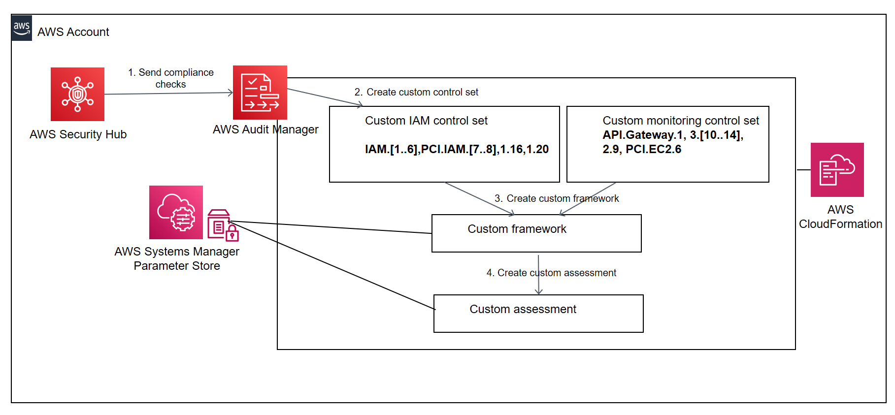

# Automate audit preparation in AWS and integrate across the Three Lines Model - Build a custom integration of AWS Audit Manager with AWS Security Hub

Creates a custom AWS Audit Manager framework that is comprised of custom AWS Audit Manager control sets. The custom Audit Manager control set contains custom AWS Audit Manager controls related to AWS Security Hub findings that span across AWS Security Hub FSBP, CIS and PCI compliance checks. So, instead of the control set being specific to an individual AWS Security Hub compliance check (FSBP,CIS or PCI), the control set spans across Security Hub compliance checks and is specific to a security related domain – for e.g. Identity Management or Network Monitoring. 

## Solution Design

## How To Install

**Prerequisites**

1. Ensure that AWS Security Hub is enabled in your account.

2. Follow the steps to set up AWS Audit Manager.

3. Create an Amazon S3 bucket with the following name: s3-customauditmanagerframework-AccountId-Region where the AccountId is your AWS Account ID and Region is the AWS Region where you have deployed this template. In this bucket, create a folder named CustomAuditManagerFramework_Lambda and upload the CustomAuditManagerFramework_Lambda.zip (it's in the lambda folder) file there.	

4. Audit Manager works with the Boto3 1.7 libraries. AWS Lambda doesn't ship with Boto3 1.7 by default. This implementation provides that version of Boto3 as a Lambda Layer. Upload the auditmanagerlayer.zip (it's in the layer folder) to the root folder of the S3 bucket created in step 2. 

5. If you have already configured an assessment reports destination in your Audit Manager settings then you can skip this step. Otherwise, create a folder (for e.g. 'evidences) in the S3 bucket in step 2. Your assessment reports destination will be the S3 URI for e.g. s3://s3-customauditmanagerframework-AccountId-Region/evidences/. AWS Audit Manager will save your assessment reports to this bucket.

6. Create an IAM user with Audit owner permissions. https://docs.aws.amazon.com/audit-manager/latest/userguide/security_iam_service-with-iam.html#security_iam_service-with-iam-id-based-policies

**Setup** 

The solution automates the initial setup and deployment in two steps:

1.	Launch the **aws-auditmanager-securityhub.yml** template. For parameters - 1) Provide the name of the S3 bucket and folder (from step 3 in the prerequisites) that contains the source CustomAuditManagerFramework_Lambda.zip 

2. Launch the **aws-auditmanager-customassessment.yml** template. Provide the s3 uri (from step 5 in the prerequisites) that is the assessment destination as a parameter and 2) Provide the ARN of the Audit owner IAM user from step 6 in the pre-requisites

**Cleanup**

1. Delete the CloudFormation stacks in sequence- 1) aws-auditmanager-customassessment.yml and then 2) aws-auditmanager-securityhub.yml
2. Delete the custom framework  as well as the custom controls created in Audit Manager (you can do this from the console)
3. Delete the Audit Manager framework ID from the SSM parameter store

