

## Build AWS Audit Manager Assessments

In this lab, we will create a custom Audit Manager Assessment by configuring custom controls, frameworks and assessments with AWS Audit Manager.

## Prerequisites
1. [Enable AWS Config](https://docs.aws.amazon.com/config/latest/developerguide/getting-started.html) in your AWS Account
2. [Setup AWS Audit Manager](https://docs.aws.amazon.com/audit-manager/latest/userguide/setting-up.html#setup-audit-manager). In the [AWS Audit Manager console](https://console.aws.amazon.com/auditmanager/home), configure your [AWS Audit Manager settings](https://docs.aws.amazon.com/audit-manager/latest/userguide/console-settings.html).
3. Create an [IAM user with Audit owner permissions](https://docs.aws.amazon.com/audit-manager/latest/userguide/security_iam_service-with-iam.html#security_iam_service-with-iam-id-based-policies). You can use the AWSAuditManagerAdministratorAccess policy as a starting point for this lab, but scope down these permissions as appropriate for your requirements.
4. If you have already configured an [assessment reports destination](https://docs.aws.amazon.com/audit-manager/latest/userguide/console-settings.html#settings-destination) in your AWS Audit Manager settings, you can skip this step. Otherwise, you can simply reuse the Amazon S3 bucket you created in step 2. The bucket must be in the same AWS Region as your assessment. Create a folder in the bucket for evidence and then create a directory. Your assessment reports destination will be the Amazon S3 URI (for example, s3://s3-customauditmanagerframework-<AccountId>-<Region>/evidences/). AWS Audit Manager will save your assessment reports to this bucket.

## Create a custom control

We will configure a custom control that is comprised of 3 data sources. Each data source collects evidence based on the evaluation of a specific AWS Config rule.

1. Navigate to the [AWS Audit Manager console](https://console.aws.amazon.com/auditmanager/home) and from the left navigation pane, select **Control library**, and then select **Create custom control**. 

2. Under **Control name**, enter a name (for example, Custom Control) and an optional description and then select **Next**.
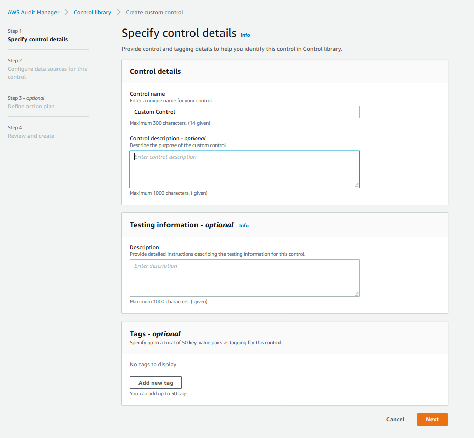

3. In **Configure data sources for this control**, choose **Automated evidence**. Under **Select an evidence type by mapping to a data source**, select **Compliance checks for resource configurations from AWS Config**. In **Specify an AWS Config rule**, select **CLOUD_TRAIL_ENCRYPTION_ENABLED**. Select **Add data source** to add another data source
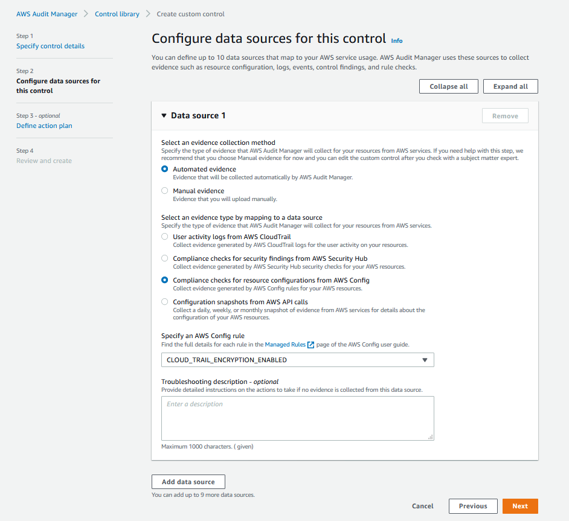

4.  Follow Step 3 above and add the **CLOUD_TRAIL_ENABLED** and **S3_ACCOUNT_LEVEL_PUBLIC_ACCESS_BLOCKS** AWS Config Rules as data sources. Select **Next**
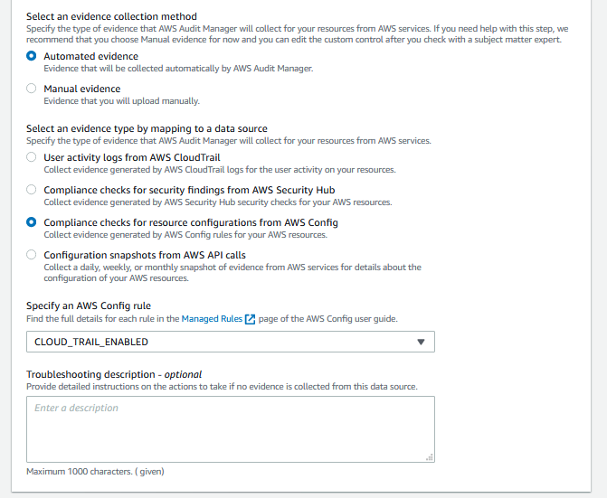

5. On the **Review and create** screen, skip defining the action plan and choose **Create custom control**. 

6. Figure below shows the Custom control displayed in the Control library: 

## Create a custom framework

Custom frameworks allow you to organize controls into control sets in a way that suits your unique requirements. Follow these steps to create a custom framework using the custom control you created in the previous section.

1. From the left panel, select **Framework library**, and then select **Create custom framework**.

2. In the **Specify framework details**, enter a name for the framework (for example, Record Custom Control). Enter an optional compliance type and description, and then select **Next**. 

3. In **Specify the controls in the control set**, and under **Control set name**, provide a name for the control set (for example, Custom Control Set). Under **Select control type**, select **Custom controls**, and then select **Add to control set**. The custom control you created earlier should be displayed under **Selected controls**.
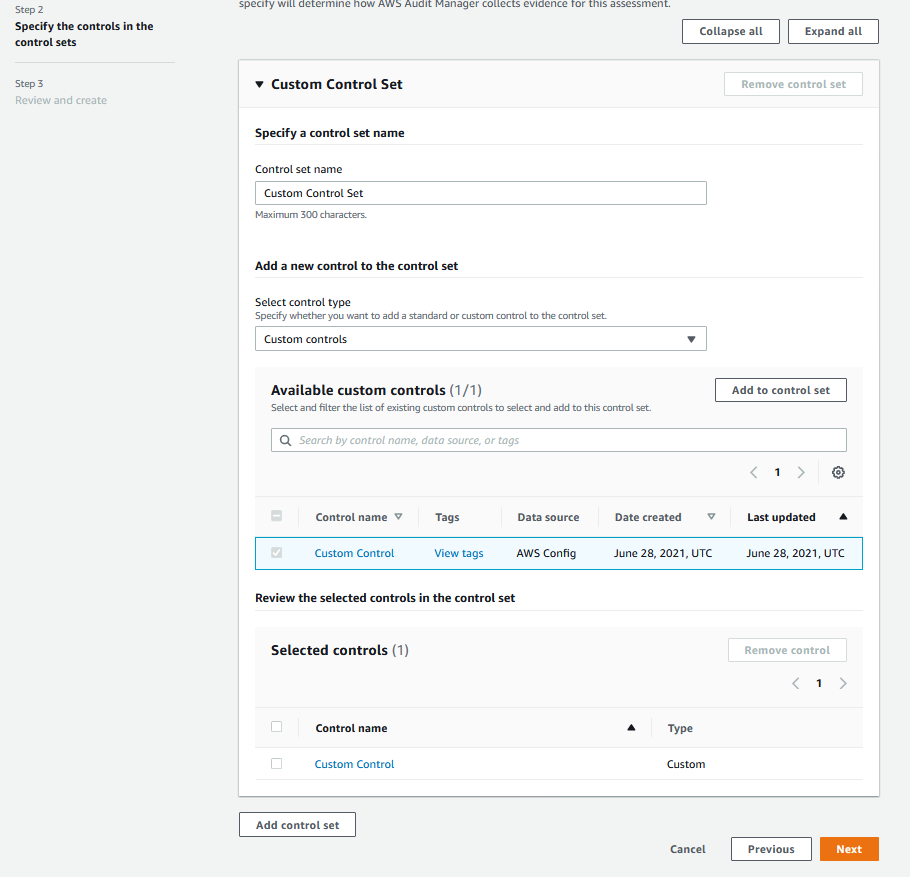

 5. On the **Review and create** screen, select **Create custom framework**. 

The figure below shows the custom framework, which consists of the custom control that we had configured earlier. 

## Create a custom assessment

An Audit Manager assessment is an implementation of the AWS Audit Manager framework. It collects the evidence related to the AWS Config Rules that you created and converts it into an auditor-friendly format, and attaches the evidence to the custom control in the framework.

1. From the left navigation pane, select **Assessments**, and then select **Create assessment**.

2. In **Specify assessment details**, under **Assessment Details** enter a name for the assessment (for example, Record Custom Control) and an optional description. Under **Assessments reports destination**, provide the  [Amazon S3](https://aws.amazon.com/s3/) from Step 5 in the prerequisites section . Under **Frameworks**, select the **Record Custom Control framework** and then select **Next**. 
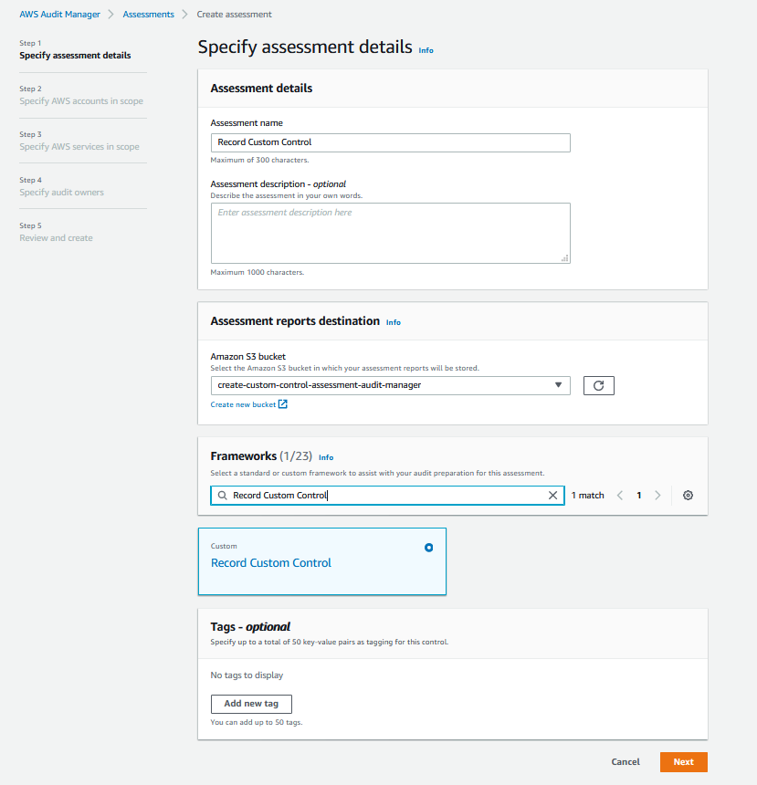

3. In **Edit AWS accounts in scope** select your current account in scope for the assessment and then select **Next**
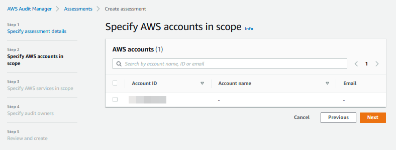

4. Under **AWS services**, select all services in scope that are automatically detected by Audit Manager  and then select **Next**.
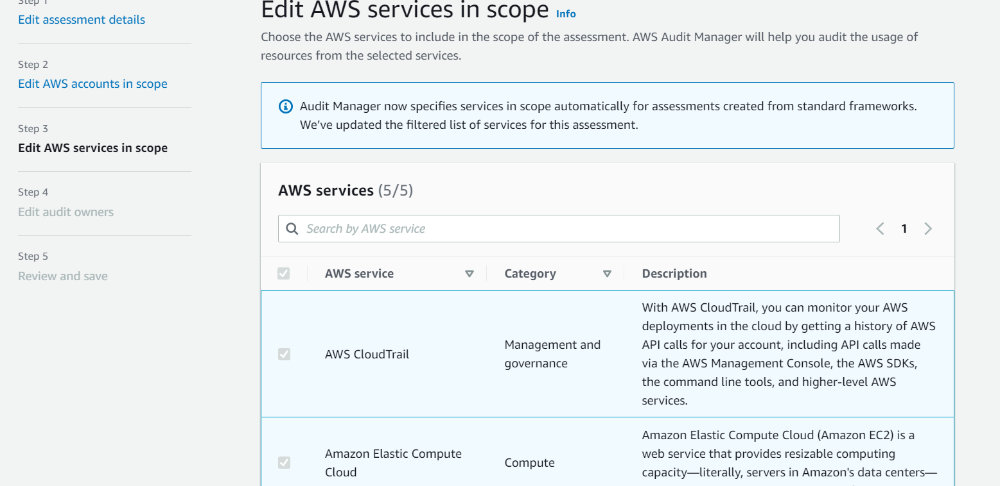

5. Under **Specify audit owners**, select the Audit owner user that you created in Step 4 in the prerequisites section.
 and then select **Next**

6. On the **Review and create** screen, select **Create assessment**.

## Review evidence
Once you create an assessment, it will automatically start collecting evidence for the custom controls that you had configured within the assessment. It may take *24 hours* for the evidence to appear on the Audit Manager Console.

1. On the [AWS Audit Manager console](https://console.aws.amazon.com/auditmanager/home), from the left paneL, select **Assessments**. Select the **Record Custom Control assessment**.

2. In **Control sets**, select the custom control you created earlier.
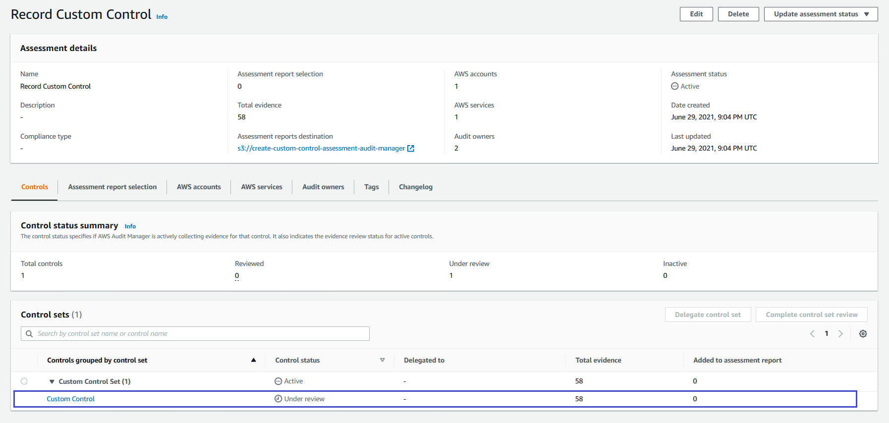

3. On the **Evidence folders** tab, you can review the evidence collection. Select an **Evidence folder**.
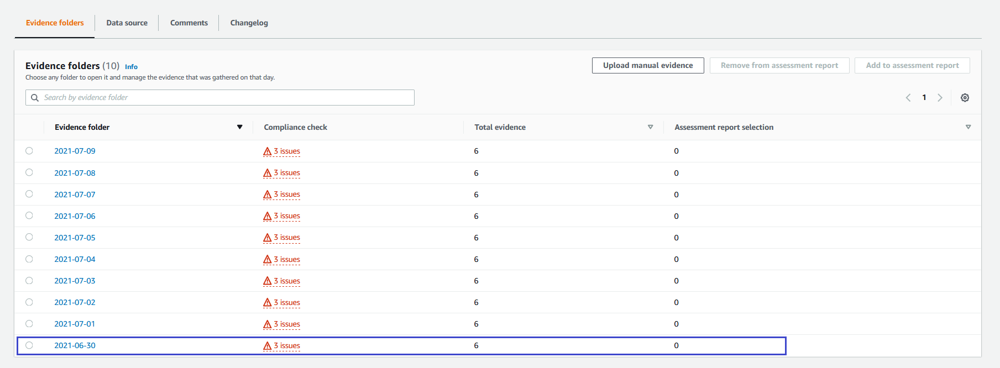

4. In the **Evidence** list, check that AWS Audit Manager has recorded compliance status at different points in time. Under the **Time** column in **Evidence** if you select one of the time slots (such as 6:17:38 PM UTC), the evidence description is displayed. Select **View JSON** next to **responseElements** to view the evidence.
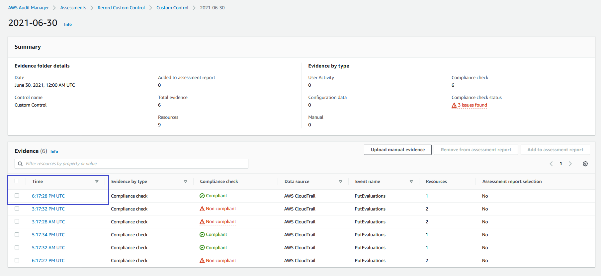

5. You can also select evidence from your custom control to add to an assessment report. You can then generate the assessment report. From the [AWS Audit Manager console](https://console.aws.amazon.com/auditmanager/home), go back to the **Evidence folder** list. To add evidence to an assessment report, select the evidence, and then select **Add to assessment report** as shown

6. From the [AWS Audit Manager console](https://console.aws.amazon.com/auditmanager/home) select your custom assessment *Record Custom Control*. Select **Assessment report selection** in the bottom panel and select **Generate assessment report**. Provide the report with a name and description.
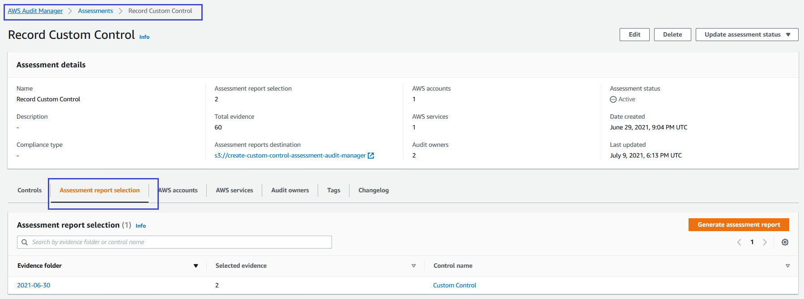

7. On the [AWS Audit Manager console](https://console.aws.amazon.com/auditmanager/home), navigate to **Assessment reports**. You can now select and download the assessment report, which includes all your selected evidence. 

8. You can also navigate to the [S3](https://console.aws.amazon.com/s3/) bucket that you had configured as the assessment reports destination earlier and view the assessment report from there
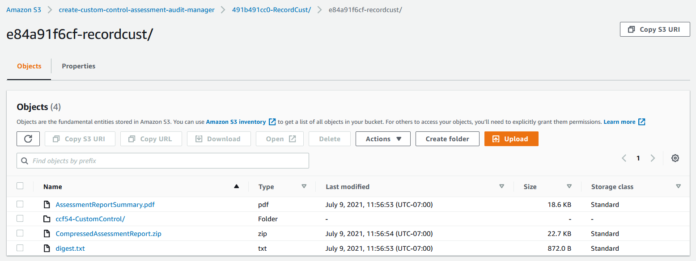

## Automate building of custom Audit Manager Assessments based on Security Hub findings

## Overview
AWS Security Hub provides an out of the box integration with AWS Audit Manager where Security Hub findings based on Security Hub security standards are sent to Audit Manager. If compliance checks from Security Hub security standards are the only data source for an Audit Manager control then the out of the box Audit Manager control set (as well as the Audit Manager framework and assessment) correspond to one of the three supported AWS Security Hub security standards – Foundational Security Best Practices (FSBP), Center for Internet Security (CIS) or Payment Card Industry (PCI).

In this lab, we will deploy a solution that builds custom controls in AWS Audit Manager based on Security Hub findings

The Audit Manager custom controls are organized into control sets. The custom control set in our solution contains AWS Audit Manager controls related to AWS Security Hub findings that span across the FSBP, CIS and PCI standards.  The Audit Manager control set is not specific to the Security Hub security standard but it is specific to a security-related domain (for example, identity management or network monitoring). The Audit Manager control set includes controls from all three Security Hub security standards (FSBP, CIS or PCI) as they relate to that specific domain. This is a common use case where customers want to delegate audit assurance responsibilities to security administrators based on their subject matter expertise.

Refer to [Integrate across the Three Lines Model (Part 1): Build a custom automation of AWS Audit Manager with AWS Security Hub](https://aws.amazon.com/blogs/mt/integrate-across-the-three-lines-model-part-1-build-a-custom-automation-of-aws-audit-manager-with-aws-security-hub/) for a full description of this solution. 

## Prerequisites
1.	[Enable Security Hub](https://docs.aws.amazon.com/securityhub/latest/userguide/securityhub-enable.html#securityhub-enable-console) in your account
2.  [Setup AWS Audit Manager](https://docs.aws.amazon.com/audit-manager/latest/userguide/setting-up.html#setup-audit-manager). In the [AWS Audit Manager console](https://console.aws.amazon.com/auditmanager/home), configure your [AWS Audit Manager settings](https://docs.aws.amazon.com/audit-manager/latest/userguide/console-settings.html).
3. Create an [IAM user with Audit owner permissions](https://docs.aws.amazon.com/audit-manager/latest/userguide/security_iam_service-with-iam.html#security_iam_service-with-iam-id-based-policies). You can use the AWSAuditManagerAdministratorAccess policy as a starting point for this lab, but scope down these permissions as appropriate for your requirements.
4. Create an Amazon S3 bucket with the following name: s3-customauditmanagerframework-*AccountId*-*Region* where *AccountId* is your AWS account ID and *Region* is the AWS Region where you plan to deploy the CloudFormation templates. In this bucket, create a folder named *CustomAuditManagerFramework_Lambda*. [Create a directory](https://docs.aws.amazon.com/AmazonS3/latest/user-guide/create-folder.html) and then upload the [CustomAuditManagerFramework_Lambda.zip](https://github.com/aws-samples/aws-securityhub-remediations/blob/main/aws-auditmanager-securityhub/lambda/CustomAuditManagerFramework_Lambda.zip) file there.
4. If you have already configured an [assessment reports destination](https://docs.aws.amazon.com/audit-manager/latest/userguide/console-settings.html#settings-destination) in your AWS Audit Manager settings, you can skip this step. Otherwise, you can simply reuse the Amazon S3 bucket you created in step 4. The bucket must be in the same AWS Region as your assessment. Create a folder in the bucket for evidence and then [create a directory](https://docs.aws.amazon.com/AmazonS3/latest/user-guide/create-folder.html). Your assessment reports destination will be the Amazon S3 URI (for example, s3://s3-customauditmanagerframework-*AccountId*-*Region*/evidences/). AWS Audit Manager will save your assessment reports to this bucket.
5. Audit Manager works with the [Boto3 1.7](https://boto3.amazonaws.com/v1/documentation/api/1.7.74/index.html) libraries. AWS Lambda doesn’t ship with Boto3 1.7 by default. This implementation provides that version of Boto3 as a [Lambda layer](https://docs.aws.amazon.com/lambda/latest/dg/configuration-layers.html). Upload the [auditmanagerlayer.zip](https://github.com/aws-samples/aws-securityhub-remediations/blob/main/aws-auditmanager-securityhub/layer/auditmanagerlayer.zip) to the top directory of the Amazon S3 bucket you created in step 4.

## Install the solution

1. In the [AWS Audit CloudFormation console](https://console.aws.amazon.com/cloudformation), create a stack to launch the [aws-auditmanager-securityhub.yml](https://github.com/aws-samples/aws-securityhub-remediations/blob/main/aws-auditmanager-securityhub/cft/aws-auditmanager-securityhub.yml) template. In **Parameters**, enter the values for the parameters based on their descriptions in the template. The template takes the following parameters:
**SourceBucket**: The name of the Amazon S3 bucket that contains the AWS Lambda source code. This is the bucket you created in step 3 of the prerequisites. Replace <AccountID> and <Region> with the AWS account ID and Region where you are deploying this template.

2. In the [AWS Audit CloudFormation console](https://console.aws.amazon.com/cloudformation), create a stack to launch the [aws-auditmanager-customassessment.yml](https://github.com/aws-samples/aws-securityhub-remediations/blob/main/aws-auditmanager-securityhub/cft/aws-auditmanager-customassessment.yml) template. In **Parameters**, enter the values for the parameters based on their descriptions in the template. The template takes the following parameters:
**AssessmentDestination**: The S3 URI in which AWS Audit Manager will save your assessment reports. This is the S3 URI from step 4 of the prerequisites. Replace *AccountID* and *Region* with the AWS account ID and Region where you are deploying this template.
**AuditOwnerArn**: The ARN for the IAM user that you created in step 3 of the prerequisites.

## Review the Custom Audit Manager Controls, Framework and Assessment

1. Navigate to the [AWS Audit Manager console](https://console.aws.amazon.com/auditmanager/home). From the left panel, select **Control library** and then select **Custom Control** on the right panel. You will see the list of custom controls that have been created for IAM and Networking monitoring related areas that span across the Security Hub compliance standards.
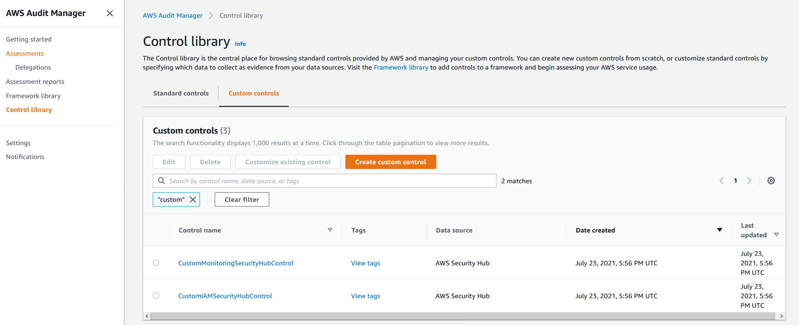

2. Click on the *CustomMonitoringSecurityHubControl* to view the data sources for this custom control. All data sources use Security Hub Findings, however they span across the 3 compliance standards supported by Security Hub and are specific to monitoring related findings
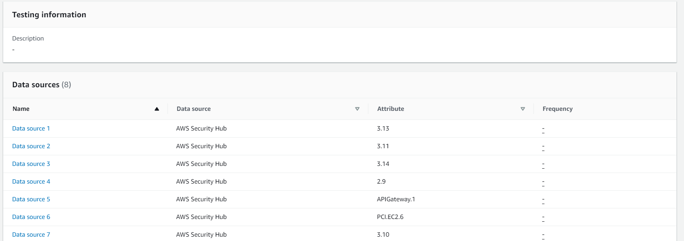

3. Click on the *CustomIAMSecurityHubControl* to view the data sources for this custom control. All data sources use Security Hub Findings, however they span across the 3 compliance standards supported by Security Hub and are specific to IAM related findings
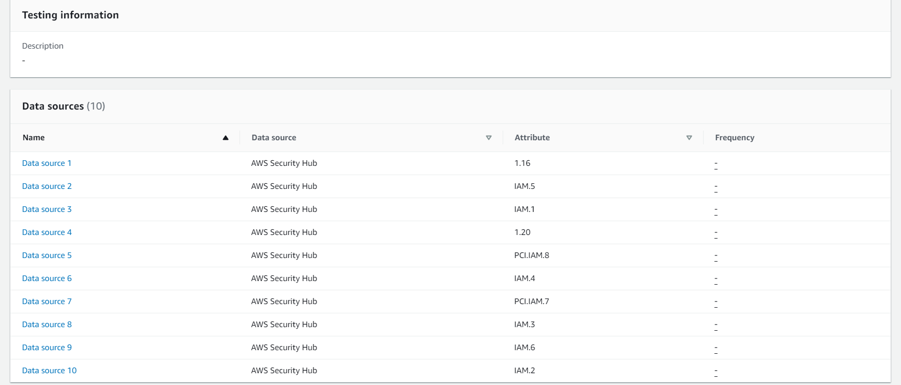

4. From the left panel, select **Framework Library** and then select **Custom Framework** on the right pane to view the custom Audit Manager framework *Security Hub Custom Framework* that was provisioned by the solution.
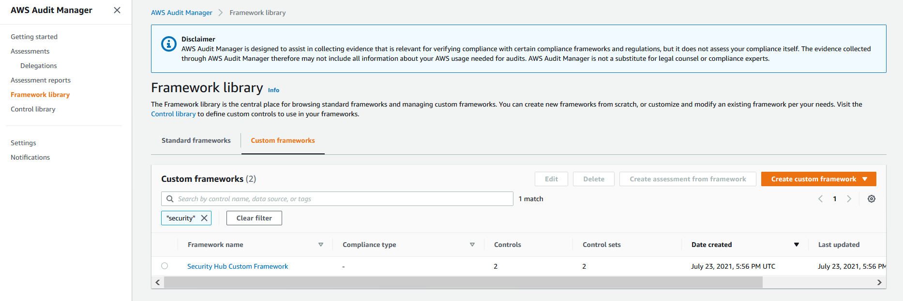

5. Select the custom framework from the previous step.  Under the **Control** section, you will see that this framework incorporates custom Security Hub controls that you reviewed in the **Custom Control** tab from Step 1.
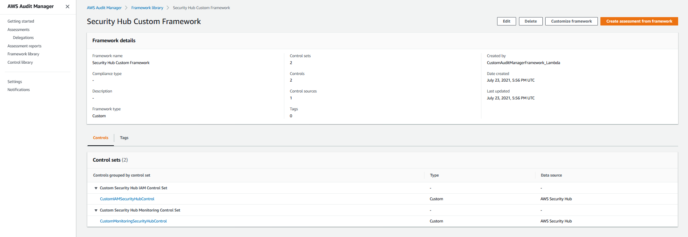

6. On the left hand panel, select **Assessments** and you will see that a custom assessment was provisioned by the solution. Select the custom assessment named **CustomSecurityHubAssessment** and view the custom controls that correspond to the assessment.

Once you create an assessment, it will automatically start collecting evidence for the custom controls that you have configured within the assessment. It may take 24 hours for the evidence to appear on the Audit Manager Console.

## Customizing AWS Audit Manager - Automate building of custom AWS Audit Manager assessments - Transform an AWS Config Conformance Pack to an AWS Audit Manager Assessment

AWS Config conformance packs provide a sample mapping between a supported compliance standard and AWS Config Managed Rules. Conformance packs enable the grouping of multiple AWS Config rules to a specfic control id within the compliance standard. By transforming AWS Config conformance packs into custom Audit Manager assessments we can extend Audit Manager to provide custom assessments for dozens of compliance standards that are not supported out of the box by Audit Manager.

In this lab, we will deploy a solution that builds custom controls in AWS Audit Manager. The Audit Manager custom controls are organized into control sets. Each control set corresponds to a control id in the conformance pack. The Audit Manager control set comprises of the AWS Config rules mapped to the control id by the AWS Config conformance pack. Our solution then creates a custom framework and a custom assessment based on these custom controls.

Refer to [Integrate across the Three Lines Model (Part 2): Transform AWS Config conformance packs into AWS Audit Manager assessments](https://aws.amazon.com/blogs/mt/integrate-across-the-three-lines-model-part-2-transform-aws-config-conformance-packs-into-aws-audit-manager-assessments/) for a full description of this solution. This solution is also available from the [AWS Cloud Compliance and Assurance Reference Solution](https://github.com/aws-samples/aws-cloud-compliance-assurance)

## Prerequisites
1. Ensure that you have completed all the prerequisites from the *Build AWS Audit Manager Assessments* lab
2. Create a control mapping file. This is a CSV file where each row contains a control ID for the compliance standard as the first column. The remaining columns of that row each contain one AWS Config rule that maps to the control ID. A row can have any number of columns. You can use the [sample mapping file](https://github.com/aws-samples/aws-config-pci-fsbp-ssmremediations/blob/main/aws-auditmanager-conformancepack/mappingfile/nerc-cipmappingfile.csv) for NERC-CIP here directly or create your own for any of the supported compliance standards. The mapping of these rules to the control ID of the compliance standard is created manually by the user from the compliance standard’s [conformance pack documentation](https://docs.aws.amazon.com/config/latest/developerguide/operational-best-practices-for-nerc.html).
3. Create an Amazon S3 bucket with the following name: s3-customauditmanagerframework-<AccountId>-<Region> where <AccountId> is your AWS account ID and <Region> is the AWS Region where you plan to deploy the CloudFormation templates. In this bucket, create a folder named CustomAuditManagerFramework_Lambda. [Create a directory](https://docs.aws.amazon.com/AmazonS3/latest/user-guide/create-folder.html) and then upload the [CustomAuditManagerFramework_Lambda.zip](https://github.com/aws-samples/aws-config-pci-fsbp-ssmremediations/blob/main/aws-auditmanager-conformancepack/lambda/CustomAuditManagerFramework_Lambda.zip) file there.
4. Upload the control mapping file to the top directory of the S3 bucket.
5. Audit Manager works with the [Boto3 1.7](https://boto3.amazonaws.com/v1/documentation/api/1.7.74/index.html) libraries. AWS Lambda doesn’t ship with Boto3 1.7 by default. This implementation provides that version of Boto3 as a [Lambda layer](https://docs.aws.amazon.com/lambda/latest/dg/configuration-layers.html). Upload the [auditmanagerlayer.zip](https://github.com/aws-samples/aws-config-pci-fsbp-ssmremediations/tree/main/aws-auditmanager-conformancepack/layer) to the top directory of the Amazon S3 bucket you created in step 3.

## Install the solution

1. In the [AWS Audit CloudFormation console](https://console.aws.amazon.com/cloudformation), create a stack to launch the [aws-auditmanager-confpack.yml](https://github.com/aws-samples/aws-config-pci-fsbp-ssmremediations/blob/main/aws-auditmanager-conformancepack/cft/aws-auditmanager-confpack.yml) template. In **Parameters**, enter the values for the parameters based on their descriptions in the template. The template takes the following parameters:
**SourceBucket**: The name of the Amazon S3 bucket that contains the AWS Lambda source code. This is the bucket you created in step 3 of the prerequisites. Replace <AccountID> and <Region> with the AWS account ID and Region where you are deploying this template.
**ConfPackControlsMappingFile**: This is the full name of the control mapping file, including the .csv extension (for example, nerc-cipmappingfile.csv) created in in step 2 of the prerequisites and uploaded to S3 in step 4 of the prerequisites.

2. In the [AWS Audit CloudFormation console](https://console.aws.amazon.com/cloudformation), create a stack to launch the [aws-auditmanager-customassessment.yml](https://github.com/aws-samples/aws-config-pci-fsbp-ssmremediations/blob/main/aws-auditmanager-conformancepack/cft/aws-auditmanager-customassessment.yml) template. In **Parameters**, enter the values for the parameters based on their descriptions in the template. The template takes the following parameters:
**AssessmentDestination**: The S3 URI in which AWS Audit Manager will save your assessment reports. This is the S3 URI from step 4 of the prerequisites  from the *Customizing AWS Audit Manager - Build a custom Audit Manager Assessment* lab. Replace <AccountID> and <Region> with the AWS account ID and Region where you are deploying this template.
**AuditOwnerArn**: The ARN for the IAM user that you created in step 3 of the prerequisites from the *Customizing AWS Audit Manager - Build a custom Audit Manager Assessment* lab

## Review the Custom Audit Manager Controls, Framework and Assessment

1. Navigate to the [AWS Audit Manager console](https://console.aws.amazon.com/auditmanager/home). From the left panel, select **Control library** and then select **Custom Control** on the right panel. You will see the list of custom controls that have been created for the NERC-CIP compliance standard.

2. From the left panel, select **Framework Library** and then select **Custom Framework** on the right pane to view the custom Audit Manager framework *Config Conformance Pack Custom Framework* that was provisioned by the solution

3. Select the custom framework from the previous step.  Under the **Control** section, you will see that this framework incorporates custom NERC-CIP controls that you reviewed in the **Custom Control** tab from Step 1
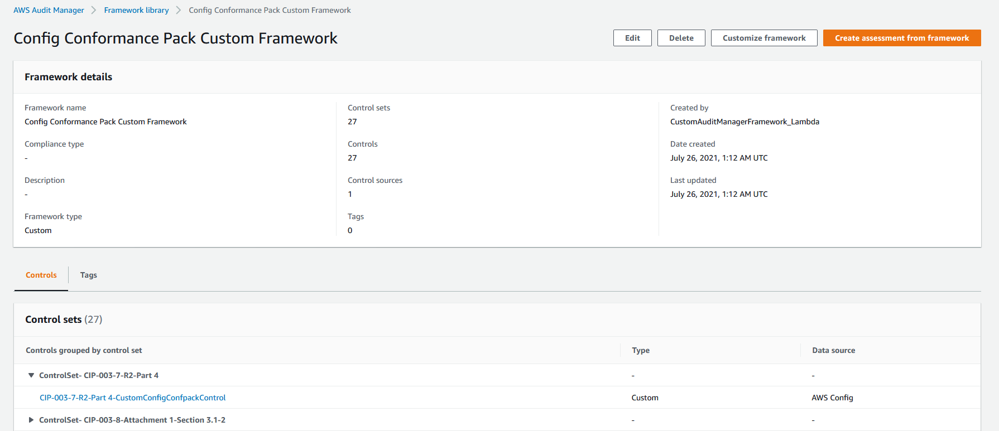

4. On the left hand panel, select **Assessments** and you will see that a custom assessment was provisioned by the solution. Select the custom assessment named **CustomConfigCongPackAssessment** and view the custom controls that correspond to the NERC-CIP compliance standard

Once you create an assessment, it will automatically start collecting evidence for the custom controls that you have configured within the assessment. It may take 24 hours for the evidence to appear on the Audit Manager Console.