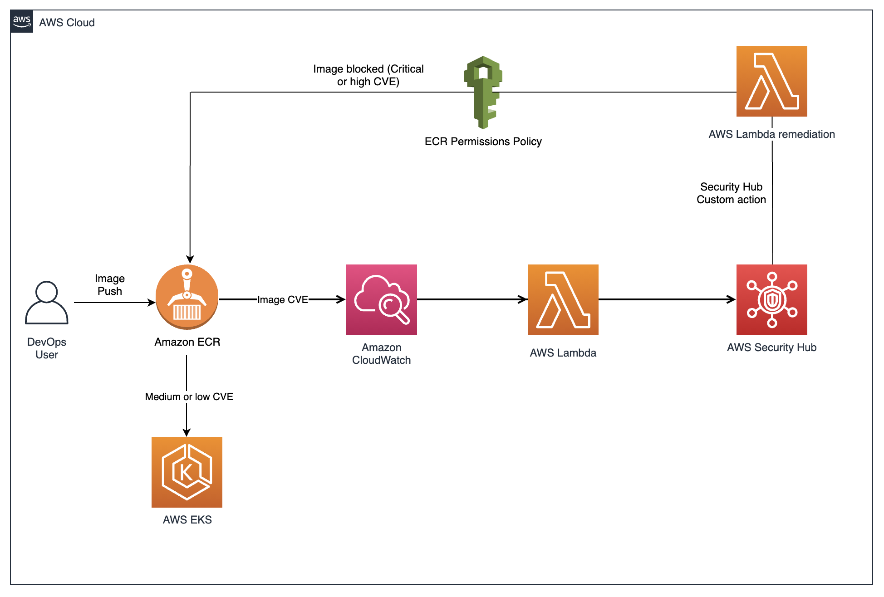

# Automated Container Image Compliance with AWS ECR and AWS Security Hub

* AWS ECR Image Vulnerabilities to be pushed as findings to AWS Security Hub
* AWS Security Hub Remediation action restricts access to any AWS ECR container image when a vulnerability is detected during an image scan
* Demonstrates **"Custom Detection"** AND **"Custom Remediation"** by AWS Security Hub. 

## What is Built

1. **Template: aws-ecr-continuouscompliance-v1.yml**: Provisions the following components:
    * Amazon CloudWatch Events (EventBridge) Rule:
        * The CloudWatch Events Rule is triggered based on a AWS ECR Event for a completed Image Scan
    * AWS Lambda as a target for the CloudWatch Events Rule:
        * Obtains event details from the AWS ECR Completed Image scan event.
        * Sends Finding to AWS Security Hub via ASFF (https://docs.aws.amazon.com/securityhub/latest/userguide/securityhub-findings-format.html)
    * AWS Security Hub based Remediation
        * Creates an Amazon CloudWatch Events Rule which is triggered based on a AWS Security Hub Custom Action (https://docs.aws.amazon.com/securityhub/latest/userguide/finding-send-to-custom-action.html)
        * Provisions an AWS Lambda as a target for the AWS Security Hub Custom Action
        * AWS Lambda that creates an AWS ECR repository policy that denies access if the Image scan event has a vulnerability (Critical or High)

## How it Works and Solution Design
1. Triggers an AWS Security Hub finding whenever an image is scanned in ECR - either when configuring the ECR repository for a scan on push (https://docs.aws.amazon.com/AmazonECR/latest/userguide/image-scanning.html#scanning-new-repository) or via a manual scan. 
	1. Provisions an Amazon CloudWatch Events (EventBridge) Rule that gets triggered based on AWS ECR Event (https://docs.aws.amazon.com/AmazonECR/latest/userguide/ecr-eventbridge.html) on a completed image scan.  The target for Amazon CloudWatch Events (EventBridge) Rule is an AWS Lambda function that translates the event from the Image Scan into AWS Security Finding Format (https://docs.aws.amazon.com/securityhub/latest/userguide/securityhub-findings-format.html) for Security Hub. 
2. Provisions an AWS Security Hub Custom Action for remediation. The Security Hub based Remediation attaches an AWS ECR Repository Policy (https://docs.aws.amazon.com/AmazonECR/latest/userguide/repository-policies.html)that is scoped for controlling access to the specific  individual Amazon ECR repository where the vulnerable image is detected

## Set up and Test

1. **Initial Setup**
    * 1 step setup. Launch the aws-ecr-continuouscompliance-v1.yml template. The template takes no parameters.
2. **Test - Push an image to ECR** 
	* Push an image with known vulnerabilities to ECR (e.g. nginx:latest).  Follow the steps as outlined here (https://docs.aws.amazon.com/AmazonECR/latest/userguide/docker-push-ecr-image.html)
	* Navigate to the AWS Security Hub console and click on Findings in the left panel. Select the relevant finding and with our solution you can also optionally search for ECR related findings by adding a filter with ResourceType is AwsEcr in the top panel . [*(Show Security Hub Findings image)*.]
	* With the relevant finding selected in the AWS Security Hub Findings panel, select Actions from the top of the panel and click on the ‘ECR1’ action.
	* Navigate to  the AWS ECR console, select the Repository that contains the vulnerable image and validate the Deny permissions policy provisioned by the Security Hub remediation action by selecting Permissions in the left panel

## @kmmahaj