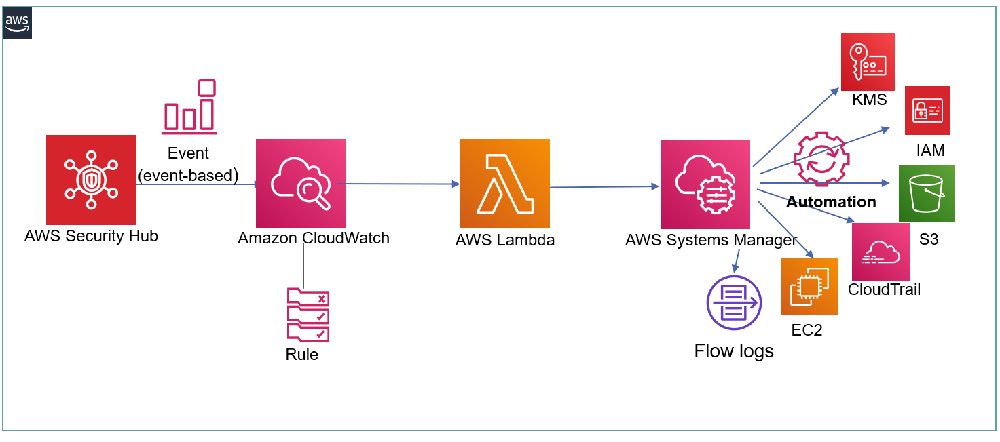

# Automated Remediations for PCI DSS 3.2.1 using AWS Security Hub

AWS provides an Operational Best Practices for PCI DSS 3.2.1 that provide a sample mapping between the Payment Card Data Security Standard (PCI DSS) 3.2.1 and AWS Security Hub checks. 

The solution implemented here leverages the AWS Security Hub service and provides customers with an AWS native implementation for automated remediations for these PCI policy violations detected by AWS Security Hub.

## How it Works

This implementation is based on the following solution approach:

1. Leverages AWS Security Hub directly to provide continuous detection of PCI findings
2. Provides AWS Systems Manager Automation Documents for automated remediation for AWS Security Hub findings. All documents are automatically provisioned via an AWS CloudFormation template.
3. Provides integration of AWS Security Hub Custom Actions with AWS Systems Manager Automation Documents to provide real time remediations of AWS Security Hub PCI findings as follows:
* Leverages the ability of AWS Security Hub to send findings associated with custom actions to CloudWatch Events as Security Hub Findings - Custom Action events.
* The CloudWatch Events Rule invokes the corresponding Lambda Function as the Target for the source Security Hub Custom Action event
* The Lambda function processes the finding using the standard findings format provided by Security Hub - AWS Security Finding Format (ASFF) and invokes the corresponding AWS Systems Manager Automation Document with the input from the ASFF finding

## Solution Design

## How To Install

1. **Template 1 of 2:** aws-security-hub-pci-remediations-template1.yml
* Provisions AWS Systems Manager automation documents. These documents are used to provide automated remediations within the provisioned AWS Security Hub Action.
* Provisions with fully built-in pre-reqs. No input parameters required. Simply install on the CloudFormation console (or CLI). Installs in approx 3-4 mins.

2. **Template 2 of 2:** aws-security-hub-pci-remediations-template2.yml
* Provisions AWS CloudWatch Evemts and AWS Security Hub Custom Actions. No input parameters. Simply install on the CloudFormation console (or CLI). Installs in approx 3-4 mins.
* Leverages the output from the previous template specifically the AWS Systems Manager Automation documents

## COVERAGE

The solution provides remediations for the following AWS Security Hub PCI checks:
* [PCI.AutoScaling.1] Auto scaling groups associated with a load balancer should use health checks
* [PCI.CloudTrail.1] CloudTrail logs should be encrypted at rest using AWS KMS CMK
* [PCI.CloudTrail.2] CloudTrail should be enabled
* [PCI.CloudTrail.3] CloudTrail log file validation should be enabled
* [PCI.CloudTrail.4] CloudTrail trails should be integrated with CloudWatch Logs
* [PCI.CodeBuild.2] CodeBuild project environment variables should not contain clear text credentials
* [PCI.CW.1] A log metric filter and alarm should exist for usage of the "root" user
* [PCI.Config.1] AWS Config should be enabled
* [PCI.EC2.1] Amazon EBS snapshots should not be publicly restorable
* [PCI.EC2.2] VPC default security group should prohibit inbound and outbound traffic
* [PCI.EC2.3] Unused EC2 security groups should be removed
* [PCI.EC2.4] Unused EC2 EIPs should be removed
* [PCI EC2.5] Security groups should not allow ingress from 0.0.0.0/0 to port 22 
* [PCI.EC2.6] Ensure VPC flow logging is enabled in all VPCs
* [PCI.IAM.1] IAM root user access key should not exist
* [PCI.IAM.2] IAM users should not have IAM policies attached
* [PCI.IAM.3] IAM policies should not allow full * administrative privileges
* [PCI.KMS.1] Customer master key (CMK) rotation should be enabled
* [PCI.Lambda.1] Lambda functions should prohibit public access
* [PCI.Lambda.2] Lambda functions should be in a VPC
* [PCI.RDS.1] RDS snapshots should prohibit public access
* [PCI.RDS.2] RDS DB Instances should prohibit public access
* [PCI.Redshift.1] Amazon Redshift clusters should prohibit public access
* [PCI.S3.1] S3 buckets should prohibit public write access
* [PCI.S3.2] S3 buckets should prohibit public read access
* [PCI.S3.3] S3 buckets should have cross-region replication enabled
* [PCI.S3.4] S3 buckets should have server-side encryption enabled
* [PCI.SSM.1] Amazon EC2 instances managed by Systems Manager should have a patch compliance status of COMPLIANT after a patch installation

## Author

Kanishk Mahajan; kmmahaj@amazon.com

